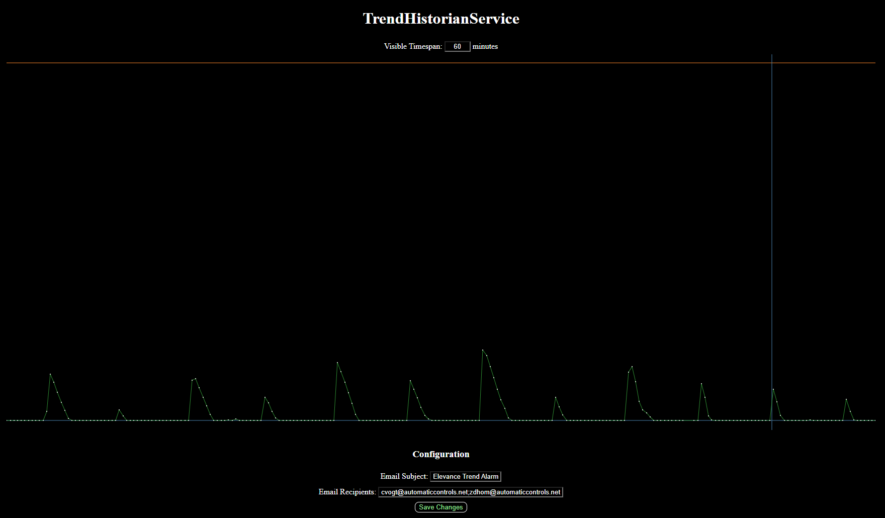

# TrendServiceMonitor

WebCTRL is a trademark of Automated Logic Corporation. Any other trademarks mentioned herein are the property of their respective owners.

This add-on monitors the queue size of the TrendHistorianService over time. Data points are recorded every 15 seconds and are stored for 3 days. When the queue size surpasses 2500, email notification alarms can be configured. A deadband of 15% is used to prevent spurious notifications. You can view a graph of queue size over time from the add-on's main page. Hold **CTRL** or **SHIFT** while navigating the graph to lock your cursor to the nearest data point. If you enter a visible timespan in minutes and press **ENTER**, the graph will reload to show the specified data.

## Installation

1. If signed add-ons are required, copy the authenticating certificate [*ACES.cer*](https://github.com/automatic-controls/addon-dev-script/blob/main/ACES.cer?raw=true) to the *./programdata/addons* directory of your *WebCTRL* installation folder.
2. Install [*TrendServiceMonitor.addon*](https://github.com/automatic-controls/trend-service-monitor/releases/latest/download/TrendServiceMonitor.addon) using the *WebCTRL* interface.